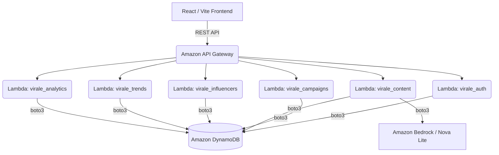

# Virale: AI-Powered Influencer Marketing Platform
## Project Deck & Architecture Overview

This document serves as the comprehensive guide for our Idea Submission, detailing our solution, architecture, and the impact of our prototype.

---

### 1. The Core Problem & Our Solution
**Problem**: Launching influencer marketing campaigns is highly manual. Brands struggle to find the right influencers, formulate localized and engaging content for varying demographics, and track ROI effectively.

**Solution**: **Virale** is an intelligent, serverless influencer marketing platform. We streamline the entire lifecycle—from influencer discovery and campaign creation to AI-driven content adaptation and real-time analytics.

---

### 2. Why & How We Are Using AI

#### **Why We Are Using AI**
Creating compelling content that resonates across different target markets and languages is time-consuming and expensive. Generic marketing copy often fails to convert. We use AI to solve the "blank page" problem for marketers, ensuring that campaign messaging is instantly tailored, localized, and contextually relevant to specific audiences.

#### **How We Are Using AI**
We leverage **Amazon Bedrock**, specifically using the `us.amazon.nova-lite-v1:0` model (with fallback mechanics to other structural models) as the cognitive engine for our content pipeline. 
When a user creates a campaign and selects a target market, our backend (`virale_content` Lambda) invokes Bedrock via `boto3`. The AI dynamically generates tailored:
- **Hooks**: Catchy opening lines to grab attention.
- **Main Body Content**: Value propositions aligned with the campaign category.
- **Calls-to-Action (CTAs)**: Engaging prompts to drive conversions.

#### **How AI is Affecting Our Prototype**
- **Instant Personalization**: Users no longer need to write copy from scratch. The prototype instantly populates campaign details with AI-generated adaptations.
- **Scalability of Campaigns**: By localizing content dynamically, a single campaign can be effortlessly scaled across multiple regions without needing a dedicated copywriting team.
- **Enhanced User Workflow**: The integration provides a "Wow" factor in the UI. Users see real-time suggestions based on current trends, bridging the gap between raw data and executable marketing strategy.

---

### 3. How We Are Utilizing AWS Services

Our entire platform is built as a cloud-native, serverless application on AWS, ensuring high availability, zero-maintenance scaling, and seamless integration. 

#### **AWS Lambda (Compute)**
We have decoupled our backend into 6 distinct stateless microservices using AWS Lambda:
1. `virale_auth`: Handles user registration and authentication workflows.
2. `virale_campaigns`: Manages the CRUD operations and lifecycle of marketing campaigns.
3. `virale_content`: Interfaces directly with AI models to generate and adapt marketing content.
4. `virale_influencers`: Drives the influencer discovery and recommendation engine.
5. `virale_trends`: Fetches and analyzes current market trends.
6. `virale_analytics`: Processes and serves dashboard metrics and ROI data.
*(We also utilize a **Lambda Shared Layer** to house shared utility functions and DB connection logic for clean code.)*

#### **Amazon DynamoDB (Database)**
We use DynamoDB as our core NoSQL database for its single-digit millisecond performance at any scale. We have tables set up for:
- User Profiles
- Campaign Data & Statuses
- Influencer Metrics
- Analytics & Trends
All Lambda functions access DynamoDB fluidly using AWS `boto3`.

#### **Amazon Bedrock (Generative AI)**
As highlighted above, Bedrock is the cornerstone of our GenAI features. We utilize the serverless API to securely invoke foundational models (like Amazon Nova Lite) without managing any underlying ML infrastructure.

#### **API Gateway & IAM**
Serverless Framework automatically configures our AWS API Gateway to route frontend REST API calls to the correct Lambda functions. AWS IAM roles strictly govern permissions, ensuring that only the `virale_content` function has the `bedrock:InvokeModel` policy.

---

### 4. Technical Architecture Diagram (Conceptual)

---

### 5. Impact & USP
- **Speed to Market**: What takes days of planning and copywriting now takes minutes.
- **Serverless Economics**: By using Lambda and DynamoDB, the cost scales exactly with usage. Zero payload when idle.
- **Built for Scale**: Ready to handle thousands of concurrent campaigns natively via AWS infrastructure.
