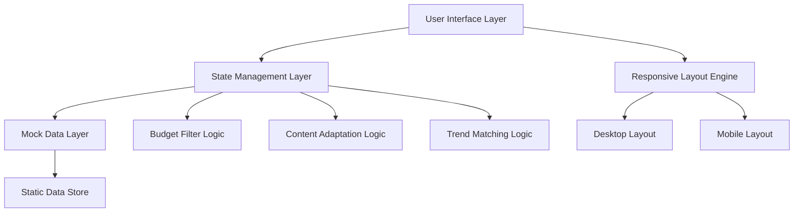

# Design Document: VIRALÉ

## Overview

VIRALÉ is a single-page web application designed for a 24-hour hackathon that demonstrates global marketing capabilities for Bharat brands. The application uses a minimalist, mobile-responsive design with Bharat-first aesthetics, featuring warm saffron accents on a clean white background. The core user experience revolves around a budget slider as the hero element, with instant mock responses to simulate real-time campaign generation.

The application follows a one-screen workflow principle where all user interactions and results are displayed on a single page, eliminating navigation complexity and focusing on the core demo flow.

## Architecture

### High-Level Architecture



### Component Architecture

The application is structured as a single-page application with the following component hierarchy:

- **App Container**: Root component managing global state
  - **Header Component**: Branding and AWS badge
  - **Main Layout Component**: Responsive layout container
    - **Input Panel Component**: Left panel (desktop) / top section (mobile)
      - **Budget Slider Component**: Primary budget selection control
      - **Category Dropdown Component**: Product category selection
      - **Market Dropdown Component**: Target market selection
      - **Content Input Component**: Campaign content text area
      - **Generate Button Component**: Campaign generation trigger
    - **Output Panel Component**: Right panel (desktop) / bottom section (mobile)
      - **Trending Opportunities Component**: Top 3 trends display
      - **Influencer Recommendations Component**: Budget-matched influencers
      - **Adapted Content Component**: Localized content output
  - **Footer Component**: AWS Bedrock attribution

### Data Flow

1. **User Input**: Budget slider, dropdowns, and content input trigger state updates
2. **State Management**: Central state tracks budget, category, market, and content
3. **Mock Data Filtering**: Static data is filtered based on current state
4. **UI Updates**: Components re-render with filtered data instantly
5. **Campaign Generation**: Button click reveals all recommendations simultaneously

## Components and Interfaces

### Core Components

#### Budget Slider Component

**Purpose**: Primary input control for campaign budget selection
**Props**:
- `min`: number (5000)
- `max`: number (500000)
- `value`: number (current budget)
- `onChange`: function (budget update handler)
- `ticks`: array of tick mark values

**State**:
- `currentBudget`: number
- `displayValue`: string (formatted currency)

**Behavior**:
- Real-time value updates as user drags slider
- Automatic currency formatting (₹X,XXX)
- Tick marks at specified intervals
- Mobile-optimized large thumb control

#### Trend Card Component

**Purpose**: Display trending opportunities with alignment visualization
**Props**:
- `trend`: object containing name, alignment, timing, badge
- `alignmentPercentage`: number (0-100)

**Structure**:
```typescript
interface Trend {
  id: string;
  name: string;
  badge: string;
  alignmentPercentage: number;
  timing: string;
  description: string;
}
```

**Visual Elements**:
- Trend badge with category
- Title with hashtag formatting
- Gradient alignment bar (92% visual emphasis)
- Contextual timing information

#### Influencer Card Component

**Purpose**: Display budget-matched influencer recommendations
**Props**:
- `influencer`: object containing profile, metrics, cost
- `isWithinBudget`: boolean

**Structure**:
```typescript
interface Influencer {
  id: string;
  handle: string;
  cost: number;
  followers: number;
  engagement: number;
  niche: string;
  profilePlaceholder: string;
}
```

**Visual Elements**:
- Circular profile placeholder (emoji)
- Handle with @ prefix
- Budget tag with cost
- Follower and engagement metrics
- Niche specialization tags

### Layout Components

#### Responsive Layout Engine

**Desktop Layout (1200px+)**:
- Two-column grid: 40% input panel, 60% output panel
- Fixed sidebar for input controls
- Scrollable output area for recommendations

**Mobile Layout (<1200px)**:
- Vertical stack: Input → Trends → Influencers → Output
- Full-width budget slider with enhanced touch targets
- Sticky generate button at bottom
- Collapsed card layouts for space efficiency

#### Input Panel Layout

**Desktop**:
- Vertical stack of input controls
- Generous spacing between elements
- Fixed width for consistent alignment

**Mobile**:
- Full-width controls
- Reduced vertical spacing
- Touch-optimized sizing

#### Output Panel Layout

**Desktop**:
- Three-section vertical layout
- Equal height allocation for each section
- Horizontal card arrangements where space allows

**Mobile**:
- Single-column card stacks
- Reduced card content for readability
- Swipe-friendly card spacing

## Data Models

### Application State Model

```typescript
interface AppState {
  budget: number;
  category: string;
  market: string;
  content: string;
  isGenerated: boolean;
  trends: Trend[];
  influencers: Influencer[];
  adaptedContent: AdaptedContent;
}
```

### Mock Data Models

#### Trend Data Structure

```typescript
interface TrendData {
  fitness_brazil: Trend[];
  // Additional category-market combinations for future expansion
}

const mockTrends = {
  fitness_brazil: [
    {
      id: "verao-fitness",
      name: "#VerãoFitness Challenge",
      badge: "Fitness Trend",
      alignmentPercentage: 92,
      timing: "Hot in São Paulo • 24h peak window",
      description: "Summer fitness challenge trending across Brazil"
    },
    {
      id: "samba-workout",
      name: "Samba Workout Challenge",
      badge: "Dance Fitness",
      alignmentPercentage: 87,
      timing: "Rising in Rio • 48h window",
      description: "Dance-based fitness combining traditional samba moves"
    },
    {
      id: "beach-protein",
      name: "Beach Protein Shake Trend",
      badge: "Nutrition",
      alignmentPercentage: 84,
      timing: "Peak in coastal cities • 72h window",
      description: "Post-workout nutrition trend at beach locations"
    }
  ]
};
```

#### Influencer Data Structure

```typescript
const mockInfluencers = {
  fitness_brazil: [
    {
      id: "fit-brazil",
      handle: "@FitBrazil",
      cost: 8500,
      followers: 28000,
      engagement: 12,
      niche: "Fitness • Beach Workouts",
      profilePlaceholder: "👤"
    },
    {
      id: "sao-paulo-gym",
      handle: "@SaoPauloGym",
      cost: 9200,
      followers: 35000,
      engagement: 10,
      niche: "Urban Fitness • Gym Culture",
      profilePlaceholder: "💪"
    },
    {
      id: "rio-wellness",
      handle: "@RioWellness",
      cost: 7800,
      followers: 22000,
      engagement: 15,
      niche: "Wellness • Outdoor Training",
      profilePlaceholder: "🏃"
    }
  ]
};
```

#### Content Adaptation Model

```typescript
interface AdaptedContent {
  original: string;
  adapted: string;
  language: string;
  culturalElements: string[];
  projectedEngagement: number;
}

const contentAdaptation = {
  "Crush your summer goals!": {
    original: "Crush your summer goals!",
    adapted: "Bora arrasar nesse verão! 💪 #DesafioVerão",
    language: "Portuguese (Brazil)",
    culturalElements: ["Bora" (Let's go), "arrasar" (crush it), local hashtag],
    projectedEngagement: 240
  }
};
```

## Visual Design System

### Color Palette

| Color Name | Hex Code | Usage |
|------------|----------|-------|
| Saffron Primary | #FF9933 | Buttons, badges, accent elements |
| Teal Success | #138D75 | Success states, positive indicators |
| Gold Gradient End | #FFD700 | Alignment bar gradient endpoint |
| White Background | #FFFFFF | Main background, card backgrounds |
| Text Primary | #2C3E50 | Main text content |
| Text Secondary | #7F8C8D | Supporting text, metrics |
| Border Light | #ECF0F1 | Card borders, dividers |
| Shadow | rgba(0,0,0,0.1) | Card shadows, depth |

### Typography

**Font Stack**: `-apple-system, BlinkMacSystemFont, 'Segoe UI', Roboto, sans-serif`

**Font Sizes**:
- Header: 24px (desktop), 20px (mobile)
- Card Title: 18px (desktop), 16px (mobile)
- Body Text: 16px (desktop), 14px (mobile)
- Caption: 14px (desktop), 12px (mobile)
- Button Text: 16px (all devices)

**Font Weights**:
- Headers: 600 (semi-bold)
- Card Titles: 500 (medium)
- Body Text: 400 (regular)
- Captions: 400 (regular)

### Component Styling

#### Budget Slider Styling

```css
.budget-slider {
  width: 100%;
  height: 8px;
  background: #ECF0F1;
  border-radius: 4px;
  position: relative;
}

.budget-slider-thumb {
  width: 24px;
  height: 24px;
  background: #FF9933;
  border-radius: 50%;
  cursor: pointer;
}

.budget-slider-track {
  height: 8px;
  background: linear-gradient(to right, #FF9933, #FFD700);
  border-radius: 4px;
}

@media (max-width: 1199px) {
  .budget-slider-thumb {
    width: 32px;
    height: 32px;
  }
}
```

#### Card Styling

```css
.trend-card, .influencer-card {
  background: #FFFFFF;
  border-radius: 8px;
  padding: 16px;
  box-shadow: 0 2px 8px rgba(0,0,0,0.1);
  border-left: 4px solid #FF9933;
  margin-bottom: 16px;
}

.alignment-bar {
  width: 100%;
  height: 8px;
  background: #ECF0F1;
  border-radius: 4px;
  overflow: hidden;
}

.alignment-bar-fill {
  height: 100%;
  background: linear-gradient(to right, #FF9933, #FFD700);
  transition: width 0.3s ease;
}
```

#### Button Styling

```css
.generate-button {
  background: #FF9933;
  color: #FFFFFF;
  border: none;
  border-radius: 8px;
  padding: 12px 24px;
  font-size: 16px;
  font-weight: 500;
  cursor: pointer;
  transition: background 0.2s ease;
}

.generate-button:hover {
  background: #E8851F;
}

@media (max-width: 1199px) {
  .generate-button {
    position: sticky;
    bottom: 16px;
    width: calc(100% - 32px);
    margin: 16px;
    padding: 16px 24px;
  }
}
```

### Responsive Breakpoints

- **Desktop**: 1200px and above
- **Tablet**: 768px to 1199px
- **Mobile**: Below 768px

### Layout Grid

**Desktop Grid**:
- Container: 1200px max-width, centered
- Input Panel: 480px width (40%)
- Output Panel: 720px width (60%)
- Gutter: 24px between panels

**Mobile Grid**:
- Container: 100% width with 16px side margins
- Single column layout
- 16px vertical spacing between sections

## Error Handling

### Input Validation

**Budget Slider**:
- Minimum value enforcement (₹5,000)
- Maximum value enforcement (₹500,000)
- Automatic snapping to valid increments

**Dropdown Selections**:
- Default value fallbacks
- Invalid selection prevention
- State persistence across interactions

**Content Input**:
- Maximum character limits
- Special character handling
- Empty input graceful handling

### Mock Data Fallbacks

**Missing Data Scenarios**:
- Default trend display when category-market combination unavailable
- Fallback influencer recommendations
- Generic content adaptation when specific adaptation unavailable

**Error States**:
- Graceful degradation for missing mock data
- User-friendly error messages
- Automatic retry mechanisms for transient issues

## Testing Strategy

The testing approach combines unit tests for component functionality with property-based tests for universal behaviors, ensuring comprehensive coverage of the hackathon prototype.

### Unit Testing Focus

**Component Testing**:
- Budget slider value updates and formatting
- Dropdown selection state management
- Card rendering with mock data
- Responsive layout switching
- Button interaction handling

**Integration Testing**:
- State management across components
- Mock data filtering logic
- Layout responsiveness across breakpoints
- User interaction flows

### Property-Based Testing Configuration

**Testing Library**: Fast-check (JavaScript/TypeScript property-based testing)
**Test Configuration**: Minimum 100 iterations per property test
**Tag Format**: Feature: aura-lite, Property {number}: {property_text}

Each property test references its corresponding design document property and validates universal behaviors across all valid inputs.

## Correctness Properties

*A property is a characteristic or behavior that should hold true across all valid executions of a system-essentially, a formal statement about what the system should do. Properties serve as the bridge between human-readable specifications and machine-verifiable correctness guarantees.*

Based on the prework analysis and property reflection to eliminate redundancy, the following properties validate the core behaviors of the VIRALÉ system:

### Property 1: Budget slider real-time synchronization
*For any* valid budget value within the slider range, moving the slider to that position should immediately update the displayed budget text to match the slider position with proper currency formatting
**Validates: Requirements 1.2, 1.5**

### Property 2: Budget-based influencer filtering
*For any* selected budget value, all displayed influencer recommendations should have costs within 20% of the selected budget, and the recommendations should update immediately when the budget changes
**Validates: Requirements 1.3, 4.3, 4.5**

### Property 3: Dropdown state consistency
*For any* combination of category and market selections, the system should maintain these selections throughout the session and update all recommendations (trends and influencers) to match the selected filters
**Validates: Requirements 2.3, 2.4, 2.5**

### Property 4: Trend card completeness
*For any* displayed trend card, it should contain all required elements: trend badge, title, alignment bar with gradient visualization, and contextual timing information
**Validates: Requirements 3.2, 3.4**

### Property 5: High-alignment trend emphasis
*For any* trend with alignment percentage above 90%, the system should apply visual emphasis to distinguish it from lower-alignment trends
**Validates: Requirements 3.5**

### Property 6: Influencer card completeness
*For any* displayed influencer card, it should contain all required elements: profile placeholder, handle, budget tag, follower metrics, engagement rate, and niche information
**Validates: Requirements 4.2, 4.4**

### Property 7: Content adaptation consistency
*For any* input content and target market combination, the adapted content should maintain the core message while applying appropriate language localization, cultural references, and market-specific hashtags
**Validates: Requirements 5.2, 5.4, 5.5**

### Property 8: Touch target accessibility
*For any* interactive element on mobile devices, the touch target should be at least 44px in both width and height to ensure accessibility compliance
**Validates: Requirements 6.5**

### Property 9: Trend card visual consistency
*For any* trend card, it should have white background, subtle shadow, and saffron (#FF9933) left border to maintain visual design system compliance
**Validates: Requirements 7.4**

### Property 10: Instant content loading
*For any* user interaction that triggers content updates, the new content should appear immediately without loading states or delays
**Validates: Requirements 8.2**

### Property 11: Input state preservation
*For any* combination of user inputs (budget, category, market, content), these values should be preserved when the campaign generation is triggered and results are displayed
**Validates: Requirements 9.4**

### Property 12: Cross-device header/footer visibility
*For any* screen size or device orientation, the header and footer should remain visible and properly formatted
**Validates: Requirements 10.4**

## Error Handling

### Input Validation Strategies

**Budget Slider Constraints**:
- Automatic clamping to valid range (₹5,000 - ₹500,000)
- Graceful handling of invalid programmatic values
- Fallback to default budget (₹25,000) on initialization errors

**Dropdown Selection Validation**:
- Default selection enforcement (Fitness, Brazil)
- Invalid option rejection with fallback to defaults
- State recovery mechanisms for corrupted selections

**Content Input Sanitization**:
- Maximum character limit enforcement (500 characters)
- Special character encoding for safe display
- Empty input handling with placeholder suggestions

### Mock Data Error Handling

**Missing Data Scenarios**:
- Fallback trend data when category-market combination unavailable
- Default influencer set when budget filtering returns empty results
- Generic content adaptation when specific market adaptation missing

**Data Integrity Checks**:
- Validation of mock data structure on application load
- Graceful degradation when required fields missing
- Error boundary implementation for component-level failures

### User Experience Error Recovery

**Graceful Degradation**:
- Partial functionality when some features fail
- Clear error messaging without technical jargon
- Automatic retry mechanisms for transient issues

**State Recovery**:
- Session state persistence across page refreshes
- Input value recovery after errors
- Consistent UI state regardless of error conditions

## Testing Strategy

The testing approach for VIRALÉ combines unit tests for specific component behaviors with property-based tests for universal system properties, ensuring comprehensive coverage suitable for a hackathon prototype demonstration.

### Unit Testing Focus

**Component-Specific Testing**:
- Budget slider initialization with correct range and tick marks
- Dropdown population with required options (Fitness, Brazil)
- Card rendering with exact count requirements (3 trends, 3 influencers)
- Button click behavior for campaign generation
- Responsive layout switching at breakpoints
- Color scheme compliance for design system elements

**Integration Testing**:
- Complete user workflow from input to campaign generation
- State management across component interactions
- Mock data filtering and display logic
- Cross-device layout consistency
- Error boundary behavior and recovery

### Property-Based Testing Configuration

**Testing Framework**: Fast-check for JavaScript/TypeScript property-based testing
**Test Configuration**: Minimum 100 iterations per property test to ensure comprehensive input coverage
**Test Tagging**: Each property test tagged with format: **Feature: aura-lite, Property {number}: {property_text}**

**Property Test Implementation Requirements**:
- Each correctness property must be implemented as a single property-based test
- Tests must generate random valid inputs within specified constraints
- Property validation must be deterministic and repeatable
- Test failures must provide clear counterexamples for debugging

### Testing Balance

**Unit Tests (30% of test effort)**:
- Specific examples demonstrating correct behavior
- Edge cases and boundary conditions
- Error handling scenarios
- Integration points between components

**Property Tests (70% of test effort)**:
- Universal behaviors across all valid inputs
- Comprehensive input space coverage through randomization
- System invariants and consistency rules
- Cross-component interaction validation

This balanced approach ensures that specific requirements are validated through concrete examples while universal system behaviors are thoroughly tested across the entire input space, providing confidence in the hackathon prototype's reliability and correctness.